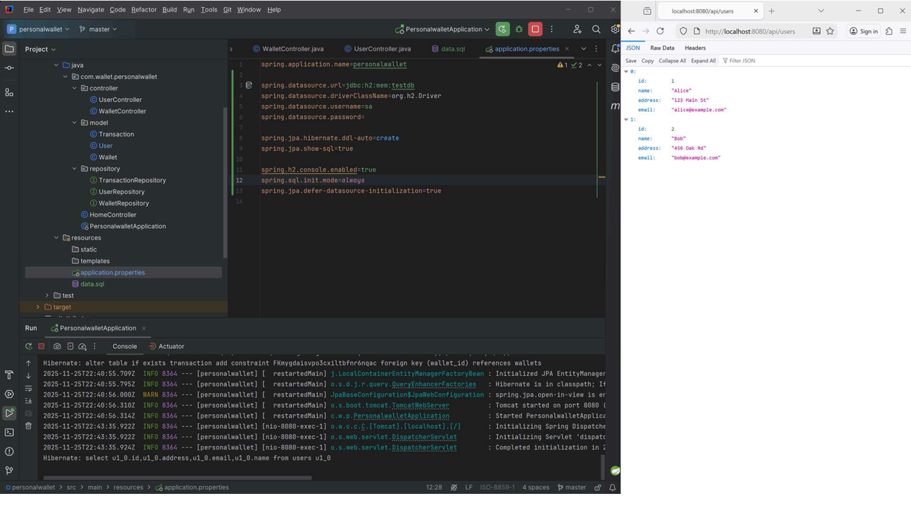

# 💰 Personal Wallet API

A Spring Boot backend application for managing a digital wallet.

This project helped me strengthen my understanding of entity relationships, REST API design, and backend architecture using Spring Boot, JPA, and Lombok.

---

## 🚀 Features

- Create and manage wallets
- Deposit and withdraw funds
- Track transaction history
- One-to-many relationship between Wallet and Transactions
- Clean and modular backend structure

---

## 🛠️ Tech Stack

- Java 17
- Spring Boot
- Spring Data JPA
- Lombok
- H2 Database
- Maven

---

## ▶️ Running the Project

To start the application:

```bash
mvn spring-boot:run
```

---

## 📸 Screenshots

### 💳 Wallet API – Users Endpoint


### ▶️ Wallet Application Running


---

## 📚 What I Learned

Through this project I improved my understanding of:

- REST API development
- Entity relationships using JPA
- Backend architecture
- Transaction handling
- Spring Boot fundamentals
- API testing using Postman

---

## 👨‍💻 Author

Peter-c-dev
